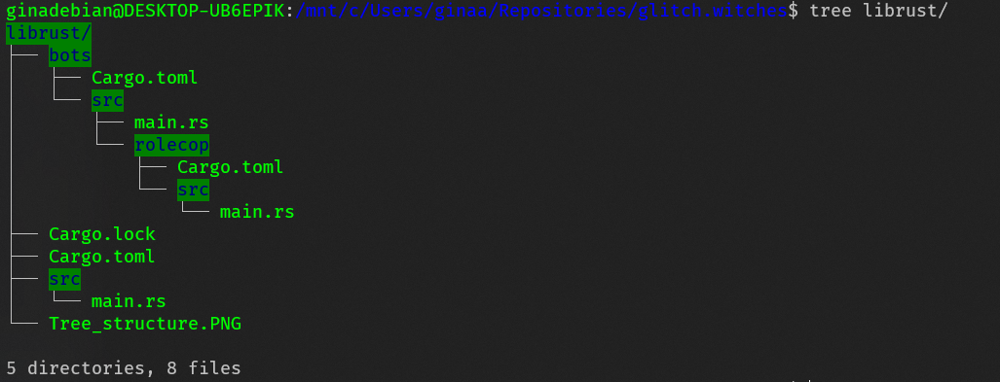

# 💻 glitch.witches 🧙‍♀️✨🧙🏿‍♀️🧙🏻‍♀️
The Last Femmetopia on the Internet: Glitch.Witches()

[Project board](https://github.com/wiredsister/glitch.witches/projects/1?add_cards_query=is%3Aopen) for outstanding work before we go public.

## Currently debating 

Should we use [Serenity](https://github.com/serenity-rs/serenity) or [discord.rs](https://github.com/SpaceManiac/discord-rs) project? Currently we include Serenity as a dependency only.

## Rust Bots Structure 

### [Installing Rust](https://www.rust-lang.org/tools/install)

### [Installing Cargo](https://doc.rust-lang.org/book/ch01-01-installation.html)

### Build

Do:

`cd librust/`

`cargo build`

### Run Executable:

From the directory `librust/`:

`cargo run`

To call a specific bot to be built, try: 

`cargo run rolecop`

In this example we are running only the rolecop bot executable.

* Note: `target/` is generated data & ignored via `.gitignore`

## TODO: 
- [x] `/bot` directory
- [x] Project Board
- [ ] Role abuse policing bot
- [ ] onboarding bot & moderation bot
- [ ] fixing up website
- [ ] creating roles and vetting sandboxing
- [ ] vetting onboarding
- [ ] touch up rules document

## Useful extensions 💾 for VSCode: 
- Rust (rust-lang.rust)
- VSCode PDF (tomoki1207.pdf)
- Remote - WSL package (only if windows, ms-vscode-remote.remote-wsl)
- Docker (ms-azuretools.vscode-docker)
