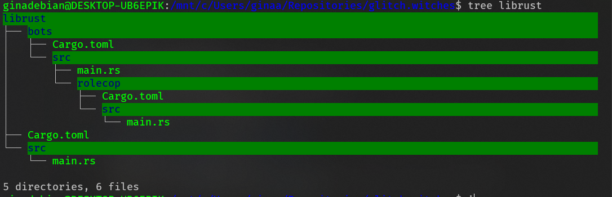

# 💻 glitch.witches 🧙‍♀️✨🧙🏿‍♀️🧙🏻‍♀️
The Last Femmetopia on the Internet: Glitch.Witches()

[Project board](https://github.com/wiredsister/glitch.witches/projects/1?add_cards_query=is%3Aopen) for outstanding work before we go public.

## Rust Bots Structure 

## TODO: 
- [x] `/bot` directory
- [x] Project Board
- [ ] Role abuse policing bot
- [ ] onboarding bot & moderation bot
- [ ] fixing up website
- [ ] creating roles and vetting sandboxing
- [ ] vetting onboarding
- [ ] touch up rules document

## Useful extensions 💾 for VSCode: 
- Rust (rust-lang.rust)
- VSCode PDF (tomoki1207.pdf)
- Remote - WSL package (only if windows, ms-vscode-remote.remote-wsl)
- Docker (ms-azuretools.vscode-docker)
